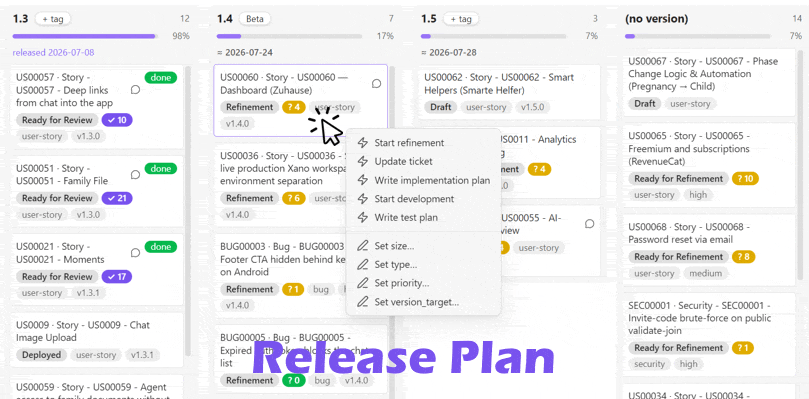

# Dispatch

**The agentic ticket board for Obsidian.**



Your coding agents ship faster than you can decide. **You are now the bottleneck** — what remains of the development cycle is deciding *what* to build, agreeing on it as a team, and reviewing what comes back. Dispatch turns an agent-friendly wiki (à la [Karpathy's LLM wiki pattern](https://gist.github.com/karpathy/442a6bf555914893e9891c11519de94f)) into the cockpit for that human side: tickets are plain notes, boards are live views over their frontmatter, and every card can dispatch a coding agent — Claude Code, Codex, any CLI — into the right repository.

- **Refinement is the new development.** The agent posts a ticket's open questions into your team chat (Slack via MCP), the team answers where it already talks, and the answers flow back into the spec. Every card shows its refinement state as a `? N` badge that burns down to green — green means build-ready.
- **Release planning is drag & drop.** The Release Plan view groups tickets by target version: live weighted progress per release, velocity-based forecasts that accumulate across versions, linked release notes for everything shipped. Drag a card — the plan is up to date the moment you drop it.
- **Meetings run themselves around you.** The agenda is prepared from the board; after the call, a NoteTaker transcript (e.g. Google Gemini) becomes an interpreted report in your vault, decisions are folded into the affected tickets automatically, and action items are tracked per person on the Meetings tab.
- **Testing works like refinement.** Manual test plans cover only what the automated suites don't; a `✓ N` badge counts the open checks through review and turns green when a ticket is safe to ship.
- **Claude Skills and MCP are the glue.** Chips on the board are one-liners (`/refine US00042`); the workflow logic behind them lives as Claude skills in your code repository — versioned with the code, reviewed like code, shared through git — while MCP connects the agent to your team's Slack, your tracker and your NoteTaker. Wiki, team and codebase become one loop, and the agents run it with you.

Under the hood, two primitives: **boards** (kanban views driven by note properties — drag & drop writes frontmatter) and **chips** (buttons that launch coding agents with the ticket as context). Desktop only — chips and automations spawn local processes.

## Team-safe configuration model

Dispatch splits its configuration into two layers so a vault can be shared across a team without leaking machine-specific paths:

| Layer | Stored in | Synced? | Contains |
| --- | --- | --- | --- |
| **Shared** | `data.json` (normal plugin settings) | yes, with the vault | folders, status property, columns, hook command, default tool |
| **This device** | `~/.dispatch/<vault>-<hash>.json` (user profile, **outside the vault**) | never | repo alias → absolute path, tool command templates, opt-in toggles |

Notes and shared settings never contain absolute paths. They reference repositories by **alias** (e.g. `my-project`), and each team member maps that alias to a local path once in *Settings → Dispatch → This device*.

Because the device layer lives outside the vault (Windows: `%USERPROFILE%\.dispatch\`), it works with **any** vault sync — Google Drive, Obsidian Sync, git — without exclusion rules, and team members can never overwrite each other's device config. The exact file path is shown in the settings tab. A `local.json` from older versions found next to the plugin is migrated there and removed from the vault automatically.

## Board

Configure in *Settings → Dispatch*:

- **Source folders** — vault folders scanned for cards (one per line)
- **Status property** — the frontmatter property that holds the column value (default `status`)
- **Order property** — the frontmatter property that holds the manual sort position within a column (default `rank`; empty disables manual ordering)
- **Columns** — ordered list, one per line (`value` or `value | Display label`). Statuses found in notes but not configured appear as extra columns at the end.
- **Title / badge properties** — what each card shows (e.g. ticket `id` as title prefix, `priority` and `type` as badges)
- **Assignee property** — who owns the ticket (e.g. `assignee`), shown as an accent-outlined `@Name` badge and always first in the slice-by bar
- **Open-questions property** — numeric frontmatter counter (e.g. `open_questions`, maintained by your refinement workflow) rendered as a `? N` badge: amber while questions remain, green at 0 (refinement complete)
- **Open-tests property** — numeric counter of open manual test-plan items (e.g. `open_tests`, set when the test plan is written) rendered as a `✓ N` badge: purple while checks remain, green at 0 (manual review complete)
- **Discussion property** — a thread URL (e.g. Slack) rendered as a chat icon in the card title that opens the link

Open the board via the ribbon icon or the command *Dispatch: Open board*. Click a card to open the note; drag it to a column to change its status, or within a column to change its position (typically used as a priority order).

### Sort order within a column

Card order is data, so it lives in the notes and syncs with the vault: dropping a card writes a numeric position into the order property. Ranks are assigned with gaps (1024 apart) and inserts take the midpoint, so a reorder normally rewrites **only the moved note**. When a column contains unranked cards or a gap is exhausted, the whole column is renormalized once (only notes whose value changes are written). Cards without a rank sort below ranked ones, alphabetically.

## Release Plan

Next to **Kanban** (status columns) sits the **Release Plan** tab — a roadmap view where columns are target versions and dragging a card between columns updates the version property immediately. (Its settings live under "Milestones".)

- A built-in **(archive)** column sits on the far left: cards whose status is excluded from progress (e.g. Rejected) plus completed cards without a version. Display-only (no drop target) — it keeps *(no version)* a pure pool of unscheduled open work.
- Other non-version planned values ("Icebox") become **special columns** left of the versions, in their *Planned versions* order. Version columns are keyed by **major.minor**: `v1.2.0`, `1.2.0` and `1.2.1` all group into the column `1.2`, so inconsistent formatting doesn't split a milestone. Dropping writes the canonical value from *Planned versions* (or the plain `major.minor` for auto-discovered columns); dropping on *(no version)* removes the property.
- **Planned versions** (settings) are always shown, even when empty — that's how you plan a future release before any ticket is assigned.
- Each version can carry one **tag** ("MVP", "Closed Beta", …) — click the tag chip in the column header to edit it; tags are shared settings, keyed by `major.minor`.
- With a **Release notes folder** configured, a column whose initial (x.y.0) release note exists shows its linked release date instead of an estimate — forecasts only appear for unreleased versions.
- The header shows a **progress bar**: `Σ(size × status progress) / Σ(size)`. Status progress comes from the third segment of the *Columns* setting (e.g. `Development | | 55`, `Done | | 100`, `Rejected | | -` to exclude); size comes from a numeric frontmatter property (default `size`, missing = 1).
- Within a version column, cards sort by workflow progress (status order, then rank) — there is no manual ordering on this tab, and drops only change the version, never status or rank.

### Automations

Rules evaluated when a card **enters a column** (settings → Automations, JSON):

```json
[
  { "when": ["Deployed"], "set": { "deployed": "{{date}}" }, "repo": "", "command": "" },
  { "when": [], "set": {},
    "repo": "my-project",
    "command": "node scripts/move-ticket.mjs {{file}} {{from}} {{to}}" }
]
```

- `when` — status values that trigger the rule; empty = every status change.
- `set` — frontmatter assignments written **atomically with the status change** (values support `{{date}}`, `{{datetime}}`, `{{from}}`, `{{to}}`). Great for stamping completion dates.
- `command` — optional shell command run in the `repo` alias, e.g. to mirror the move into Asana/Jira/Linear. Variables: `{{file}}`, `{{from}}`, `{{to}}`, `{{cwd}}` (quoted; append `Raw` for unquoted). Commands are **shared** config but run only on devices that opt in (*This device → Enable automation commands*); `set` assignments always apply.

### WIP limits, slice-by, keyboard

- **WIP limits**: the fourth segment of a *Columns* line (`In progress | | 50 | 5`) sets a limit — the header shows `count/limit`, the column outlines amber at the limit and red above it.
- **Slice-by bar**: pick a badge property (type, priority, …) in the bar above the board and click a value chip to filter both tabs to matching cards; click again to clear. Counts are shown per value; missing values group under "(none)".
- **Column chips**: click a Kanban column header for batch chips — one agent session working through every ticket in the column sequentially (`{{ids}}`, `{{status}}`, `{{count}}` variables; the repo busy-gate and queue apply as usual).
- **Keyboard**: arrow keys move the card focus, `Enter`/`o` opens the note, `[` / `]` move the focused card one column left/right (Kanban: status change; Milestones: version change).

### Release forecast

With a **Completed property** configured (e.g. `deployed`, stamped by an automation rule), release headers show a velocity-based ETA. Estimates **accumulate along the version pipeline**: a version’s ETA covers the remaining weight `Σ size × (1 − progress)` of **all earlier version lines** (including leftovers in released ones) plus its own, divided by the completed weight per day over the look-back window (default 28 days) — so a later version can never be forecast before an earlier one. Hover for the assumptions and an optimistic/pessimistic range (±40%). No completions in the window = no forecast — the feature never guesses.

### Run lifecycle (chips → board)

When a chip launches a tool, Dispatch records the run in a machine-local file (`~/.dispatch/runs/…jsonl`) and passes `DISPATCH_RUN_ID`, `DISPATCH_RUNS_FILE`, `DISPATCH_NOTE`, `DISPATCH_LABEL`, `DISPATCH_STARTED` to the process. Lifecycle hooks in the target repo (e.g. Claude Code `SessionStart`/`SessionEnd` hooks calling a three-line script) append `running`/`done` records — the board shows a live badge on the card (started → running ⇄ waiting → done; "waiting" = the agent finished its turn and the session needs you; done fades after 24 h; click a badge to mark a ghost run done or clear it), and on completion the hook appends a run-log line to the note's `## Dispatch runs` section. The plugin only *observes*: live state stays on the machine that runs the agent; durable outcomes land in the note and sync with the vault.

**One agent per working tree:** launching a chip into a repo that already has an active run opens a choice — **Queue** (starts automatically when the blocking session ends), **Run anyway**, or cancel. The queue is in-memory (unstarted entries are marked cancelled after an Obsidian restart), and staleness caps (2 h for launched, 24 h for running) keep a killed terminal from blocking a repo forever.

### Problems panel

If *Required properties* is configured (e.g. `id, status, updated`), the board shows a ⚠ badge when card notes are missing values, carry unrendered template stubs (`{ date:… }`), or use a status that isn't a configured column. Click it for the list with direct links — malformed tickets become visible the moment they appear instead of in next week's report.

### Card context menu

Right-click a card to run any chip template (see below) or edit the size / badge properties inline (empty value removes the property) — the quickest way to keep milestone weights and priorities populated.

## Meetings tab

## Todos tab

The **Todos** tab collects every open action item across your configured folders (meeting notes, tickets, any docs) into **one column per person**, with *(unassigned)* last. Items are unchecked `- [ ]` lines inside **allowlisted sections** (default: "Action items", "Open action items") — so acceptance criteria and test plans stay off the board unless you allowlist them. Owner attribution follows the standard convention (bold owner lines / inline `**Kai:** …` prefixes), with a ticket's `assignee` as fallback. **Clicking an item deep-links into the note at that exact line** — ticking happens in the document, where context and evidence notes live; the board follows within a second. Collection is cache-layered (metadata-cache pre-filter → content read only for changed files, memoized by mtime), so renders stay cheap in large vaults.

## Meetings tab

Point **Meetings folder** at a folder of meeting notes (root only) and a third tab appears: **one row per meeting, newest (incl. upcoming) at the top** — upcoming meetings get a dashed accent border. Each row shows date + participants and **that meeting's open action items broken down per person** (unchecked `- [ ]` items; owner from a bold-only section line (`**Kai**`) or an inline `- [ ] **Kai:** …` prefix; ownerless items count as *unassigned*; a green check marks meetings with nothing open). Meeting cards get their own chip templates (e.g. "Read transcript" → your meeting-report workflow), and upcoming calendar cards get their own **event chips** (`{{date}}`/`{{title}}` variables — e.g. "Prepare agenda"). With a **Calendar ICS URL** configured (device-local — e.g. Google Calendar's secret iCal address), an **Upcoming strip** on top shows the next events (DAILY/WEEKLY recurrence expanded, optional title filter): events whose date already has a meeting note link to it („agenda ✓"), the rest show „no agenda yet".

## Chips

Chips launch an AI coding agent (or any CLI) with a templated prompt, in the right repository. They come in two forms:

**Virtual chips (recommended for recurring workflows):** define *chip templates* once in settings — `label | tool | repo | prompt`, with `{{id}}`, `{{status}}`, `{{file}}`, `{{title}}` variables — and every card note automatically offers them in the board's right-click menu and the note's file menu. No markdown needed, nothing to paste into notes, and generated/regenerated documents can't lose them:

```
Refine            | claude | my-project | /refine {{id}}
Update ticket     | claude | my-project | /update-ticket {{id}}
Implementation plan | claude | my-project | /implementation-plan {{id}}
```

**Block chips (for one-offs and reports):** a fenced code block anywhere in a note. It carries **no commands and no paths** — only a prompt, a tool name, and a repo alias:

````markdown
```dispatch
label: Refine this ticket
tool: claude
repo: my-project
prompt: |
  Refine {{file}}: read the spec, check open questions,
  and propose acceptance criteria.
```
````

- `prompt` (required) — supports `{{file}}` (vault-relative path of the note), `{{title}}` (note basename), `{{vault}}` (vault path on this machine)
- `tool` (optional) — defaults to the shared *Default tool*
- `repo` (optional) — working directory alias; defaults to the vault folder
- `label` (optional) — button text

Tools are defined per device as command templates:

```
claude = start "Dispatch" /d {{cwd}} cmd /k claude {{prompt}}
codex  = start "Dispatch" /d {{cwd}} cmd /k codex {{prompt}}
```

> **Windows note:** avoid launching through `wt.exe` directly — Windows Terminal parses `;` in its command line as a *tab separator even inside quotes*, so any prompt containing a semicolon breaks. `start` opens the user's default terminal (which is usually Windows Terminal anyway) without that parsing.

macOS example:

```
claude = osascript -e 'tell app "Terminal" to do script "cd " & quoted form of {{cwd}} & " && claude " & quoted form of {{prompt}}'
```

Template variables: `{{cwd}}`, `{{prompt}}`, `{{promptFile}}` (prompt written to a temp file — use it for long/multiline prompts). All are expanded as quoted arguments; append `Raw` for unquoted (there is deliberately **no** `{{promptRaw}}`).

## Security model

Vault content is data, not code. Because notes sync across a team, Dispatch is designed so that a note can never execute an arbitrary command:

- Chip blocks only *reference* tools and repos by name; the actual commands and paths live in your device-local settings.
- Prompts are inserted as a single quoted argument (quotes/backslashes escaped, newlines flattened). For fully untrusted vaults, prefer `{{promptFile}}` in your tool templates.
- By default every chip click shows a confirmation dialog with the exact command; the post-drop hook is off per device until you enable it.

Caveat: commands run through your system shell. On Windows (`cmd.exe`), `%VAR%` sequences inside arguments are still expanded by the shell — another reason to keep the confirmation dialog on in shared vaults.

### Disclosures

- **Executes local processes** — but only commands *you* configure on *your* device (tool templates, automation commands). Note content can never introduce a command; a confirmation dialog showing the exact command is on by default.
- **Reads/writes outside the vault**: device settings at `~/.dispatch/<vault>-<hash>.json` and run records at `~/.dispatch/runs/…jsonl` — kept outside the vault deliberately so machine paths never sync.
- **One network request type** — if (and only if) you configure a calendar ICS URL, the plugin fetches that feed read-only (cached 15 min) for the Meetings tab's upcoming strip. Nothing else leaves your machine; no telemetry. Commands you configure (e.g. a script calling your tracker's API) act under your own credentials.

## Installation

Not yet in the community plugin directory. Until then:

1. Download `main.js`, `manifest.json`, `styles.css` from a release (or build from source: `npm install && npm run build`).
2. Copy them to `<vault>/.obsidian/plugins/dispatch/`.
3. Enable **Dispatch** in *Settings → Community plugins*.

Or install via [BRAT](https://github.com/TfTHacker/obsidian42-brat) with this repository's URL.

### Claude Code setup skill

Integrating Dispatch into a project (boards, device config, chips, tracker sync, agent hooks) is itself agent-guided. In [Claude Code](https://claude.com/claude-code):

```
/plugin marketplace add kaimys/obsidian-dispatch
/plugin install dispatch-setup
```

Then say "set up Dispatch for this project" in your repo — the skill interviews you and writes the config. (No Claude Code? The skill is a plain markdown checklist: `plugins/dispatch-setup/skills/dispatch-setup/SKILL.md`.)

## Development

```bash
npm install
npm run dev     # watch build (main.js with inline sourcemap)
npm run build   # type-check + production build
```

Symlink or copy the repo folder into a test vault's `.obsidian/plugins/dispatch/` and use the "Reload app without saving" command after builds.

## Roadmap

- Multiple named boards
- Column WIP limits and colors
- Card filtering
- Milestone burndown over time
- Chip runs with inline output (headless mode) instead of opening a terminal

## License

[MIT](LICENSE)
