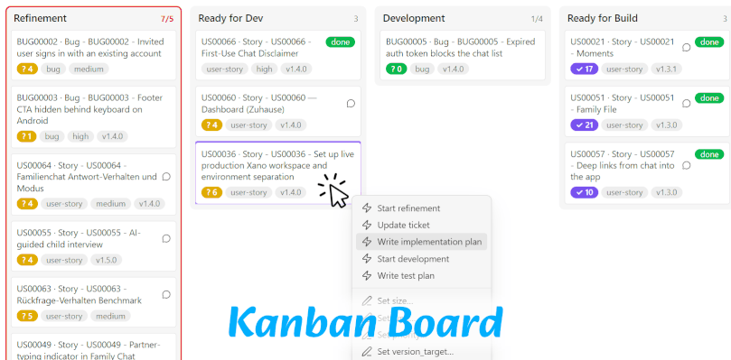

# Dispatch

**The agentic ticket board for Obsidian.**



Your coding agents ship faster than you can decide. **You are now the bottleneck** — what remains of the development cycle is deciding *what* to build, agreeing on it as a team, and reviewing what comes back. Dispatch turns an agent-friendly wiki (à la [Karpathy's LLM wiki pattern](https://gist.github.com/karpathy/442a6bf555914893e9891c11519de94f)) into the cockpit for that human side: tickets are plain notes, boards are live views over their frontmatter, and every card can dispatch a coding agent — Claude Code, Codex, any CLI — into the right repository.

- **Refinement is the new development.** The agent posts a ticket's open questions into your team chat (Slack via MCP), the team answers where it already talks, and the answers flow back into the spec. Every card shows its refinement state as a `? N` badge that burns down to green — green means build-ready.
- **Release planning is drag & drop.** The Release Plan view groups tickets by target version: live weighted progress per release, velocity-based forecasts that accumulate across versions, linked release notes for everything shipped. Drag a card — the plan is up to date the moment you drop it.
- **Meetings run themselves around you.** The agenda is prepared from the board; after the call, a NoteTaker transcript (e.g. Google Gemini) becomes an interpreted report in your vault, decisions are folded into the affected tickets automatically, and the action items show up per person on the Meetings and Todos tabs.
- **Testing works like refinement.** Manual test plans cover only what the automated suites don't; a `✓ N` badge counts the open checks through review and turns green when a ticket is safe to ship.
- **Claude Skills and MCP are the glue.** Chips on the board are one-liners (`/refine US00042`); the workflow logic behind them lives as Claude skills in your code repository — versioned with the code, reviewed like code, shared through git — while MCP connects the agent to your team's Slack, your tracker and your NoteTaker. Wiki, team and codebase become one loop, and the agents run it with you.

Under the hood, two primitives: **boards** (kanban views driven by note properties — drag & drop writes frontmatter) and **chips** (buttons that launch coding agents with the ticket as context). Desktop only — chips and automations spawn local processes.

## Documentation

| Page | What's in it |
| --- | --- |
| [Overview](docs/overview.md) | The four boards — Kanban, Release Plan, Meetings, Todos — and how each one behaves |
| [Wiki structure](docs/wiki-structure.md) | The three layers, an example folder tree to adapt, and where the wiki lives relative to your code |
| [Page types](docs/page-types.md) | The frontmatter contract: every page, tickets (incl. the freeze rule), ADRs, releases, meetings |
| [Workflow skills](docs/skills.md) | The skill catalog to adapt — ticket loop, releases, meetings, recurring maintenance |
| [Installation & configuration](docs/installation.md) | Install, settings, chips and tool commands, run lifecycle, automations, security model |

New to the idea? Read [Overview](docs/overview.md), then [Wiki structure](docs/wiki-structure.md).

## Quick start

1. Download `main.js`, `manifest.json` and `styles.css` from a release (or build from source), copy them into `<vault>/.obsidian/plugins/dispatch/`, and enable **Dispatch** in *Settings → Community plugins*. [BRAT](https://github.com/TfTHacker/obsidian42-brat) works too.
2. Point *Settings → Dispatch* at the folder holding your tickets and list your status values as columns.
3. Map your repository alias to a local path under *This device*, and add one chip template.

Or let an agent do it — in [Claude Code](https://claude.com/claude-code):

```
/plugin marketplace add kaimys/obsidian-dispatch
/plugin install dispatch-setup
```

…then say "set up Dispatch for this project". Details in [Installation & configuration](docs/installation.md).

## Roadmap

- Multiple named boards
- Column colors
- Milestone burndown over time
- Chip runs with inline output (headless mode) instead of opening a terminal
- Worktree-isolated runs, so two agents can work one repo in parallel

## License

[MIT](LICENSE)
