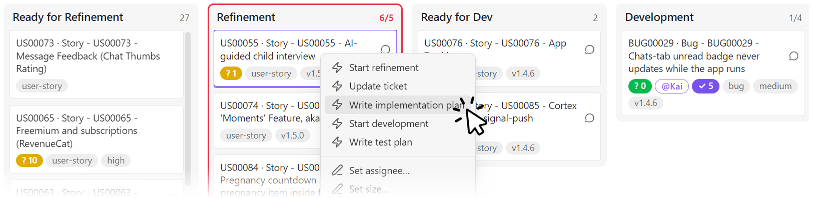
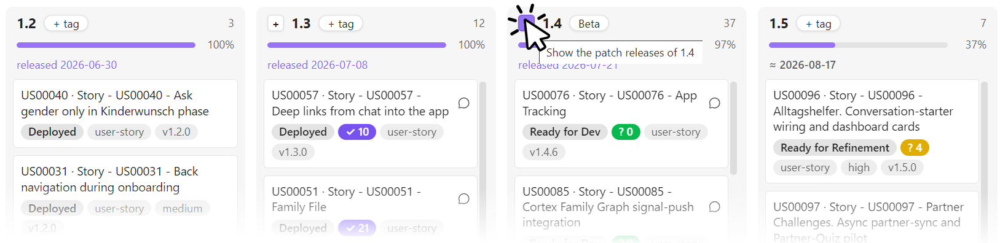
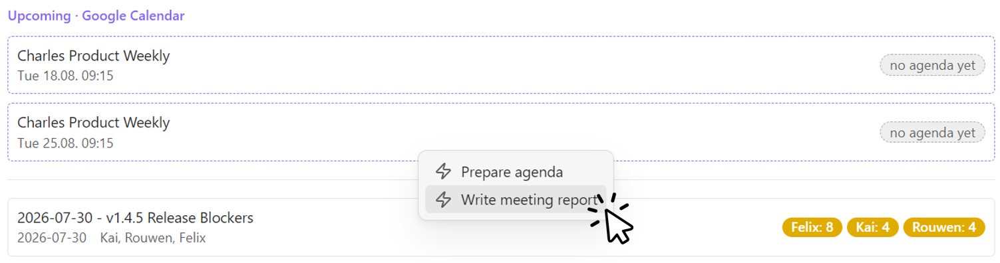
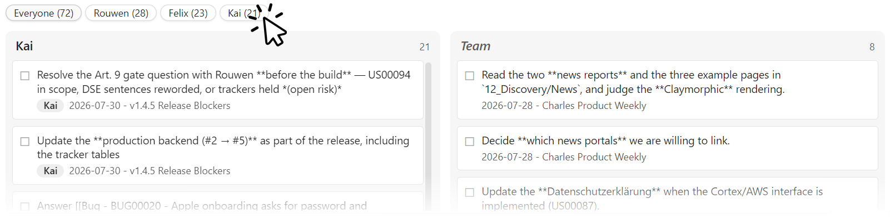

# Overview

Dispatch turns a folder of markdown notes into a live project board — and every card on it into a launcher for a coding agent.

Two primitives carry the whole plugin:

- **Boards** — views over note frontmatter. Drag a card, and the frontmatter is written immediately. There is no separate database; the notes *are* the board, so everything a board shows is greppable, diffable and syncable.
- **Chips** — buttons that launch an agent (Claude Code, Codex, any CLI) in the right repository, with the ticket as context. The board knows what the agent is doing; the note keeps what it did.

Four tabs sit above the board. **Kanban** and **Release Plan** are always there; **Meetings** and **Todos** appear once you point at their folders. A ⟳ button re-reads settings and rescans the vault — use it after a git pull or an agent run rather than restarting Obsidian.

Which frontmatter properties drive all this is up to you; see [page-types.md](page-types.md) for the contract, and [installation.md](installation.md) for where each setting lives.

## Kanban board

Columns are the values of your **status** property, in the order you configure — which means the column order *is* your pipeline, and Dispatch never invents one for you. A status found in a note but not configured shows up as an extra column at the end, so nothing silently disappears.

- **Drag between columns** to change status; **drag within a column** to change priority. Order is data: it's written back into a `rank` property with gaps of 1024 and midpoint inserts, so a reorder normally rewrites only the moved note.
- **Cards show what you configure**: a title (optionally prefixed by the ticket `id`), badges for any property (type, priority, size), an accent-outlined `@Name` for the assignee, and a chat icon linking to the discussion thread.
- **Two counters get their own badges** because they gate the workflow rather than describe it: `? N` for open refinement questions (amber → green at 0) and `✓ N` for open manual test items (purple → green at 0). Green on both means a ticket is build-ready and review-ready respectively.
- **A ⚠ problems panel** lists cards missing required properties, carrying unrendered template stubs, or using a status that isn't a column — malformed tickets surface the moment they appear.
- **Right-click a card** for its chips, or to edit size and badge properties inline.
- **Click a column header** for batch chips: one agent session working through every ticket in that column in sequence.
- **WIP limits** per column: the header shows `count/limit`, and the column outlines amber at the limit, red above it.
- **Keyboard**: arrows move focus, `Enter`/`o` opens the note, `[` / `]` move the focused card one column left or right.

## Release Plan

The same cards, grouped by **target version** instead of status. Dragging a card between columns changes only the version — never its status or rank.

- **Version columns are keyed by `major.minor`**, so `v1.2.0`, `1.2.0` and `1.2.1` all land in the same `1.2` column. Inconsistent formatting in your notes doesn't split a milestone.
- **Planned versions are always shown**, even when empty — that's how you plan a release before any ticket is assigned to it. Non-version planned values ("Icebox") become special columns on the left.
- **An (archive) column** on the far left collects cards excluded from progress (Rejected) and completed work with no version, keeping *(no version)* a clean pool of unscheduled open work.
- **Each version carries a progress bar**: `Σ(size × status progress) / Σ(size)`. Status progress is a number you assign per column (e.g. Development = 55, Done = 100, Rejected = excluded); size is a numeric property, defaulting to 1 when missing.
- **Each version can carry a tag** — "MVP", "Closed Beta" — edited by clicking the chip in the header.
- **Shipped versions link their release note** and show the release date instead of an estimate. Unreleased ones show a **velocity-based forecast** that accumulates along the pipeline: a version's ETA covers the remaining weight of every earlier version plus its own, so a later release can never be forecast before an earlier one. No completions in the look-back window means no forecast — it never guesses.
- **Patch releases expand on demand**: a `+` on a version line splits `1.4` into `1.4.0`, `1.4.1`, `1.4.2` …, each with its own progress, drop target and release note; `−` collapses it again. The expansion is view-local, so opening a line never changes anyone else's board.

Cards inside a version column sort by workflow progress — furthest-along first — so the column reads as "what's nearly done" from the top.

## Meetings board

One row per meeting, newest first, upcoming ones marked with a dashed border. Each row shows the date, the participants, and **that meeting's open action items broken down per person** — not a total, because "7 open" tells you nothing about whether it's your problem. A green check marks a meeting with nothing outstanding.

Meeting rows get their own chips (e.g. "Write the report from the transcript"), and calendar events get **event chips** with `{{date}}`/`{{title}}` variables (e.g. "Prepare agenda") — both as right-click menus, so a chip never has to be pasted into a note.

With a **calendar ICS URL** configured (device-local — a Google Calendar secret address works), an upcoming strip sits on top: recurring events expanded, filtered by title if you want. An event whose date already has a meeting note links to it (*agenda ✓*); the rest say *no agenda yet*, which is the entire status report you need before a week starts.

## Todos board

Every open action item across your configured folders, in **two columns**: **Assigned** (items with a named owner) and a fallback column — *Team* by default — for shared items nobody owns yet. A slice bar filters the assigned column to one person; the Team column always stays visible, because shared work is everyone's.

- **Items are unchecked `- [ ]` lines inside allowlisted sections** (default: "Action items", "Open action items"), so acceptance criteria and test plans don't flood the board.
- **Owner attribution** follows the convention meeting notes already use — a bold owner line (`**Kai**`) or an inline `- [ ] **Kai:** …` prefix — with a ticket's assignee as fallback. Configure the list of real names, and a bold prefix that isn't one (`**US00055:**`, `**Friday:**`) stays item text instead of inventing a person.
- **Clicking an item deep-links into the note at that line.** Ticking happens in the document, where the context and evidence live; the board follows within a second. There is deliberately no write path from the board into your notes here.

Collection is cache-layered — a metadata pre-filter, then content reads only for files that changed, memoized by mtime — so the tab stays cheap in a large vault.

## What the board doesn't do

Dispatch reads and writes frontmatter, and launches processes you configured. It does not track state of its own: no hidden database, no sync service, no server. Live agent state lives on the machine running the agent; everything durable lives in the notes and travels with your vault.

That boundary is deliberate — see [installation.md](installation.md#security-model) for what a note can and cannot cause to happen.
