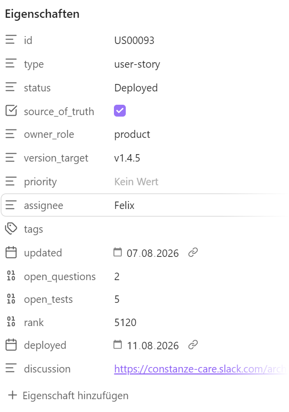

# Page types

Every page in the wiki is a page type with a frontmatter contract. The contract is what makes a vault machine-checkable: an agent can verify that a page has an owner, that a derived page was refreshed after its source moved, that a ticket is complete enough to build. Without it, "the docs are current" is a feeling.

Property *names* are yours — Dispatch reads whatever you configure. The names below are the ones the examples use.

> **Where these rules live:** in your project's `CLAUDE.md`, not in the individual skills. They are invariants that every workflow must respect; a rule copied into six skills is a rule that will hold in four of them. Skills describe procedure, `CLAUDE.md` describes what is never allowed to happen.

## Every page

```yaml
---
status: approved          # approved | draft | proposed
source_of_truth: true     # authoritative only when both are set
updated: 2026-08-13       # last meaningful change
owner: Rouwen             # accountable human → 00_Start-Here/Team/
---
```

- **`status` + `source_of_truth`** — a page is authoritative only with both. Everything else is context: useful, quotable, not binding. This is what lets you keep drafts and research in the same vault without an agent treating them as decided.
- **`updated`** — a date an agent can compare against something else. A page that claims to describe the current system and hasn't moved in six months is a finding, not a fact.
- **`owner`** — **a person, never a team.** "Everyone owns it" is how a page goes stale without anyone noticing. The owner is who gets asked when the page is wrong, and the name should resolve to a page under `00_Start-Here/Team/`.

### Derived pages

A page generated *from* something else — a schema doc from the live database, an API catalog from the code, a report from a rulebook — carries two more:

```yaml
derived_from: 07_Engineering/Backend/    # source path, repo path, or URL
maintained_by: /weekly-maintenance 1.6   # the job that regenerates it
```

**The rule that makes documentation stay current: a skill that creates a derived page must also register its refresh.** If no recurring job owns it, the skill isn't allowed to create the page — because an unmaintained generated document is worse than no document. It looks authoritative and ages silently.

That contract is checkable. A recurring job can flag:

- pages with no `owner`
- derived pages whose `derived_from` changed after their `updated` date
- pages whose `maintained_by` job no longer exists
- pages marked `source_of_truth: true` that are stubs

Which is a strictly better inconsistency report than one built on judgement calls.

## Tickets

The most important type — one note per story, bug or task, and the only type the Kanban board reads. Everything the board shows comes from frontmatter:

```yaml
---
id: US00042
type: story                    # story | bug | security | task
status: "Development"          # quote it — values contain spaces
priority: high
rank: 2048
version_target: v1.4.0
size: 3
assignee: Kai
open_questions: 0
open_tests: 5
discussion: https://…          # the thread where the team talked
updated: 2026-08-13
deployed: 2026-08-07           # stamped on completion
frozen: 2026-08-05             # stamped when the spec closes (see below)
---
```



| Property | Read by |
| --- | --- |
| `id` | card title prefix; the `{{id}}` chip variable — a ticket without one drops out of every batch chip |
| `type`, `priority` | badges, slice-by |
| `status` | **Kanban columns** — the configured order is your pipeline |
| `rank` | manual order within a column (priority) |
| `version_target` | **Release Plan columns**, normalized by `major.minor` |
| `size` | weighted progress and the velocity forecast |
| `assignee` | owner badge, slice-by, Todos fallback owner |
| `open_questions` | the `? N` badge — 0 is the gate out of refinement |
| `open_tests` | the `✓ N` badge — 0 means manual review is complete |
| `discussion` | chat icon linking to the thread |
| `deployed` | drives the velocity forecast (completed weight per day) |

Two conventions worth adopting: **quote status values**, since they contain spaces, and **make `id` mandatory** via the required-properties setting, so the problems panel catches a missing one immediately.

### The freeze rule

A ticket has two zones, and they behave differently once code exists.

**Contract zone** — Goal / Symptom, Acceptance criteria, Open questions and their answers, Scope, Implementation plan. This is what the implementation was built against.

**Record zone** — As-built notes, Test plan and results, Follow-ups, dated comments. This is what actually happened.

**The contract zone freezes when the ticket leaves development** — at the status where code exists that depends on it (*Ready for Build* in the example pipeline). Stamp `frozen:` with the date, so the boundary survives a card being dragged backwards later.

After the freeze:

1. **Contract sections are read-only.** New information becomes a dated entry in the record zone.
2. **A wrong frozen statement gets an annotation, never a rewrite:** `> ⚠️ Correction 2026-08-12: …` directly beneath it. The wrong sentence stays visible, because that is what the code was built on.
3. **New scope is a new ticket**, linked both ways. A finished ticket is not superseded — it is finished, and the new work is a different piece of work.
4. **Every skill that writes to tickets checks the freeze first.** On a frozen ticket it appends to the record zone or opens a follow-up, and says which it did.

The reason is auditability, not ceremony. If a spec can be edited after the code was written against it, then a later mismatch between spec and code has two explanations — the code is wrong, or the spec drifted — and no way to tell them apart. Rewriting an answered open question is the sharpest case: it erases what was actually decided at build time, which is often the only record of *why*.

Mark the zones in the ticket template so the boundary is visible while writing, not just documented somewhere.

## ADRs

One file per durable decision, in `07_Engineering/Decisions/`, indexed by `Decisions.md`.

```yaml
---
id: ADR-0012
status: accepted            # proposed | accepted | superseded
date: 2026-05-14
superseded_by: ADR-0031     # only when status: superseded
owner: Kai
---
```

- **Record the rejected alternatives**, not just the decision. Half an ADR's value is the deliberate *we do not do X* — those are the ones re-proposed every few months by someone who wasn't there.
- **Never delete one.** Supersede it: mark `superseded`, link forward with `superseded_by`, and leave the original in place. The link is what makes it useful — a reader lands on the old decision and is pointed to the current one, instead of merely warned off.
- **A change that contradicts an accepted ADR is a decision to reopen**, not a detail to work around.
- ADRs are written *from* tickets — the implementation-plan step is a natural extraction point, since that is where durable decisions get made and would otherwise be buried in a spec nobody reads again.

## Releases

One note per release, in `08_Delivery-and-QA/Releases/`. The Release Plan tab reads them: a note for `x.y.0` links from the version line, and each `x.y.z` links from its patch column when the line is expanded.

```yaml
---
version: v1.4.0
date: 2026-08-07
status: released            # planned | released
owner: Kai
---
```

Contents worth keeping: what shipped (as links to the tickets, which carry the detail), what the build metadata was, and what deliberately did not make it. Release notes are **events** — they were true on their date and never become untrue, so they need no currency marker. They are, however, the fastest way to answer "when did this behaviour change?", which makes the ticket links the important part.

## Meetings

One note per meeting, in `09_Meetings/`, named `YYYY-MM-DD - <meeting>.md`. Feeds both the Meetings tab and the Todos tab.

```yaml
---
date: 2026-08-04
participants: [Kai, Felix, Rouwen]
discussion: https://…        # the thread where the agenda was announced
decisions_folded: 2026-08-05 # when decisions were written into the tickets
open_items: 3
---
```

- **The agenda is written before**, from the board — open refinement questions, tests waiting for sign-off, what blocks the next release. Announce it in the thread named by `discussion:` so the team can add to it.
- **The report is written after**, from the transcript in `01_Sources/` *together with* that thread — the thread usually carries the context the transcript lacks.
- **`decisions_folded:`** is the property that matters. A meeting note's decisions are worthless until they reach the tickets they affect, and that is a real, changing, checkable state — unlike "historical", which every meeting note eventually becomes and which therefore carries no information.
- **Action items go in an allowlisted section** (default "Action items"), with an owner as a bold line or an inline `**Name:**` prefix. That is what the Todos tab collects.

Meeting notes are never authoritative. Durable outcomes get promoted — into tickets, or into an ADR — and the note stays as the record of when it was said.

## Legal and domain documents

One folder, three kinds of document that behave nothing like each other. Getting them confused is why "legal outranks product" feels wrong to anyone who has actually shipped a privacy declaration.

| Kind | Example | Where it comes from | Precedence |
| --- | --- | --- | --- |
| **External constraints** | GDPR, AI Act, medical-device rules, app-store policy | imposed on you; the text lives in `01_Sources/Domain/` | above everything — no decision of yours changes it |
| **Negotiated commitments** | privacy declaration, terms of use, data-processing agreement | *derived from* your product: counsel supplies a standard document, you state the deltas you need, counsel checks what is legally available | product leads while drafting; **binds the product once published** |
| **Generated inventories** | open-source licenses and attributions | derived mechanically from the dependency tree | a [derived page](#derived-pages) — regenerate, never hand-edit |

The middle row is the one that needs a contract, because it changes direction the moment it ships:

```yaml
---
status: approved
source_of_truth: true
owner: Rouwen              # the accountable person on your side, not the lawyer
counsel: <firm or person>  # who reviewed it
published: 2026-08-07      # the date this text went live
binds: v1.4.5              # the release whose users agreed to this text
supersedes: [[Privacy Declaration v1.3]]
---
```

- **A published legal text is never edited in place.** Publish a new version and keep the previous one verbatim — "what did this user agree to in March?" is a question you must be able to answer per release, and consent records point at a version. Same shape as the [ticket freeze](#the-freeze-rule): a document is freely editable until something depends on it, then changes become a deliberate, versioned act.
- **The drift check runs backwards.** For most engineering docs you ask "does the doc still match the code". For a published commitment you ask "**does the code still match what we promised**" — and when it doesn't, the code is the defect. Give that check a recurring job, because it is the one place where a documentation gap is a liability rather than an inconvenience.
- **Owner is internal.** The lawyer authored the text; they are not the person who notices that a shipped feature contradicts it. That is someone on your team, and their name goes in `owner:`.
- **The source artifacts belong in `01_Sources/`** — counsel's standard draft, the signed final, the regulation itself. The wiki page is your working version; the artifact is what you were actually given.

## Reports

Dated, recurring analyses in `02_Product/Reports/` — scope gaps, doc↔code drift, market scans. Derived pages, so they carry `derived_from` and `maintained_by`.

The part worth stealing: **the rulebook lives next to the reports, not in the skill.** One page per report in `_definitions/` describing what it measures, what counts as a finding, how findings are ranked, and what goes in the summary. The skill executes; the rulebook decides. That way tuning a report — raising a threshold, excluding a category, changing the KPI — is a wiki edit a non-developer can make and review, instead of a code change.
