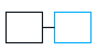

# Footnotes

Existing reference[^note-1]. New reference^[INLINE-NOTE-TEXT].

With a link^[See [the example](https://example.com/) here.] and an image^[![[pic.png|A picture]]] and a Markdown image^[].

> [!quote] Someone
> Quoted^[QUOTE-NOTE-TEXT].

Later named[^later] reference.

[^note-1]: EXISTING-NOTE-TEXT
[^later]: LATER-NOTE-TEXT
