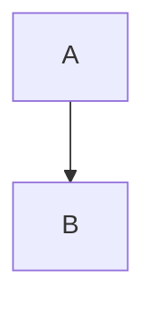

# Getting started

A first paragraph that becomes the summary. See [[Second article]] and [[Second article#Details|the details]].

![[pic.png|A small picture|300]]


A  in a sentence.

> [!tip] Remember
> Keep the **vault** private.

%% an editor's comment that must not be published %%

This is ==important==.

## Setup

## Setup

```text
Code keeps [[Not a link]] and C:\Users\me\example as they are.
```

`inline C:\Users\me code` stays too.


